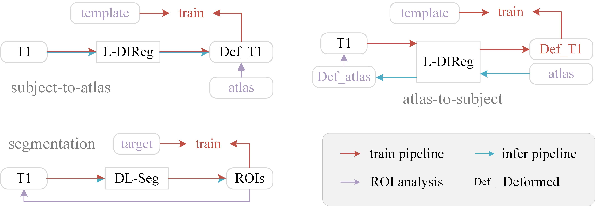

# SaB-Net: Self-attention backward network for gastric tumor segmentation in CT images

## Overview
We provide the PyTorch implementation of our BSPC submission ["Segmentation outperforms registration in quantitative analysis of brain iron"](https://doi.org/10.1016/j.bspc.2024.107446).




## Registration

### Syn and NiftyReg
Only register T1
```python
python main.py -ds [dataset]
```
Register T1 and QSM
```python
python infer_func.py  
```

### Deep learning Methods
Refer to the scripts.sh script for training and inference in the corresponding method directory.

## Segmentation
Working on.

## Dataset
Working on.

## Pretrained models
Working on.
